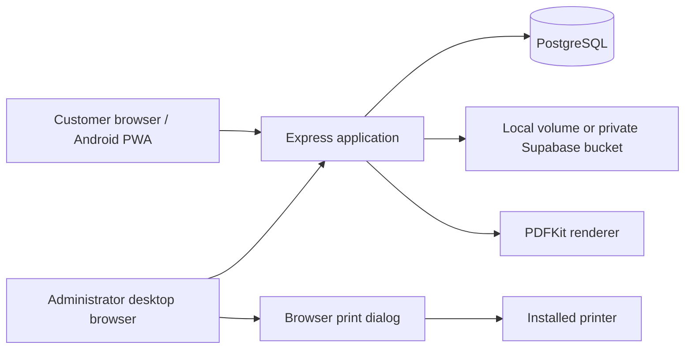

# Architecture

## Request flow

The same origin serves static pages and authenticated JSON APIs. JWT sessions use HttpOnly cookies; the database supplies the current role on authenticated requests. Users own organizations and their student records. Administrator routes use a separate role guard.

## Source map

| Files                                                                       | Responsibility                                                                    |
| --------------------------------------------------------------------------- | --------------------------------------------------------------------------------- |
| `server/index.js`                                                           | App initialization, schema setup, auth, organization/class/section/student routes |
| `server/product.js`, `server/limits.js`                                     | Designs, imports, quotas, PDF requests and manual billing                         |
| `server/storage.js`                                                         | Image validation, normalization, private reads and local/Supabase storage         |
| `server/cards.js`, `public/card-design.js`                                  | Shared card layout and PDF rendering                                              |
| `server/admin.js`                                                           | Admin reporting, activity and management routes                                   |
| `server/printing.js`, `public/print-products.js`                            | Public shop catalog and enquiries                                                 |
| `server/print-jobs.js`, `server/print-render.js`, `public/print-options.js` | Print request snapshots, sizes, HTML/PDF and workflow                             |
| `server/docker-env.js`, `server/jwt-secret.js`                              | Persistent Docker signing-secret initialization                                   |
| `public/sw.js`, `public/pwa.js`                                             | Install prompt and public offline fallback                                        |
| `test/integration/app.test.js`                                              | Real PostgreSQL workflow tests in an isolated schema                              |

Schema initialization is performed at startup by the server modules. There is no separate migration CLI. Back up data before upgrades and review schema changes with their application changes.

## Persistence and boundaries

Docker Compose creates PostgreSQL, uploads and signing-secret volumes. A short initialization container repairs the two app volume owners before the non-root app starts. `docker compose down` preserves volumes; `down -v` deletes them.

Supabase replaces local image storage when both credentials are configured. Credentials stay server-side. Private files are served through authenticated routes with ownership checks; arbitrary external image URLs are not fetched into PDFs.

Print requests preserve submitted artwork or card snapshots. Preparing a job creates a sized document; only an explicit administrator action records physical completion. A browser cannot verify printer output.

The PWA caches its public offline fallback only. Account responses, student records and artwork are not saved for offline access. This repository does not contain a native Android project.

## Testing layers

Unit tests cover card layouts, print dimensions, JWT-secret behavior and security boundaries. Integration tests cover authenticated workflows, tenant isolation, imports, quotas, billing and administrator operations against PostgreSQL. Physical printers and Android installation require separate device checks.
